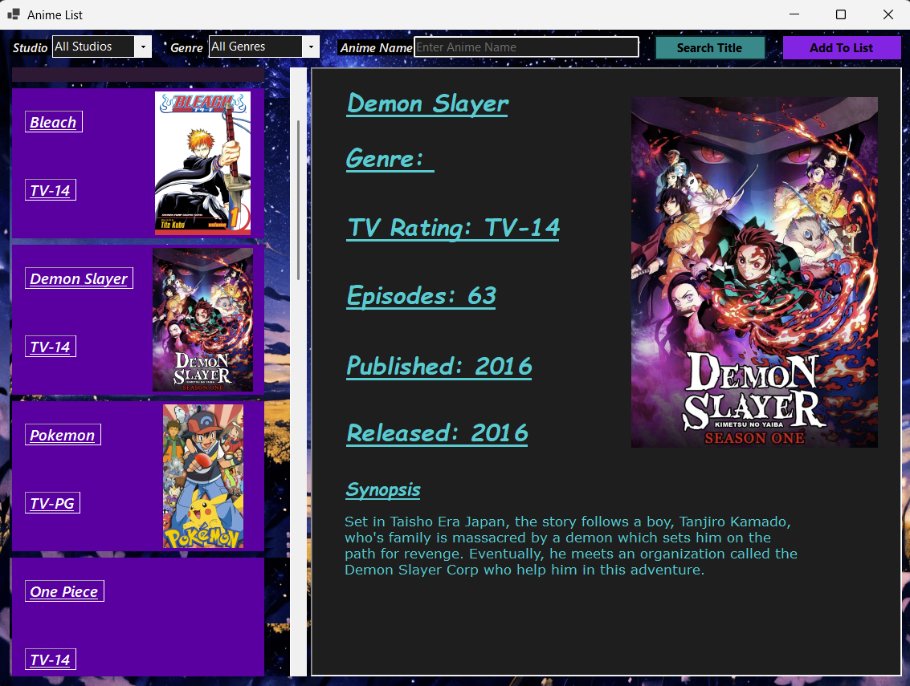
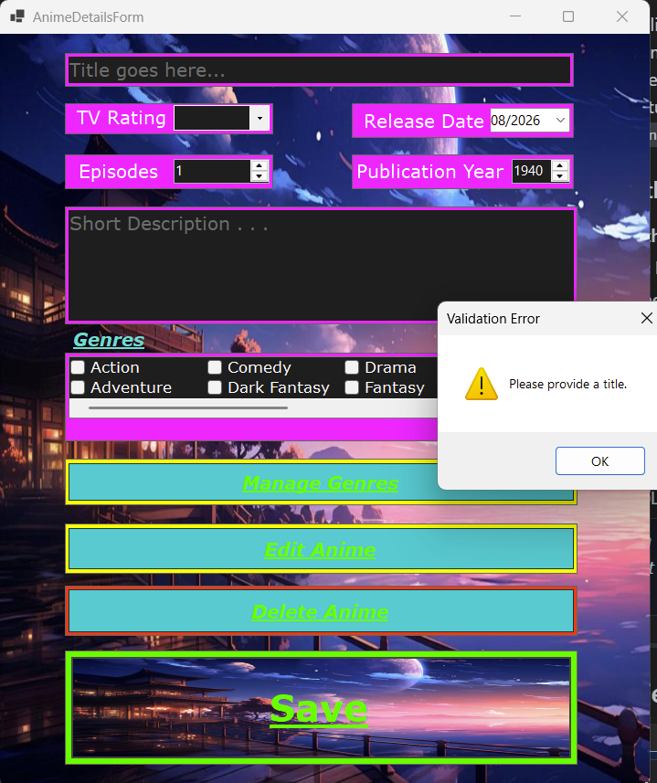
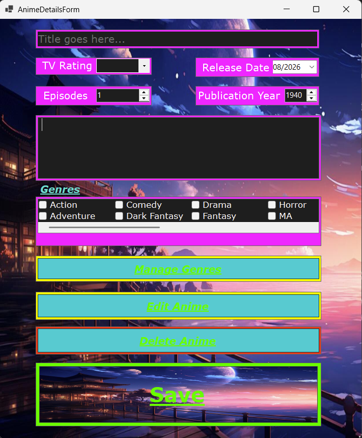
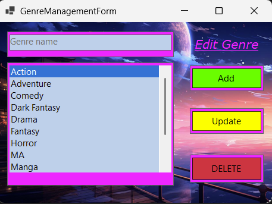
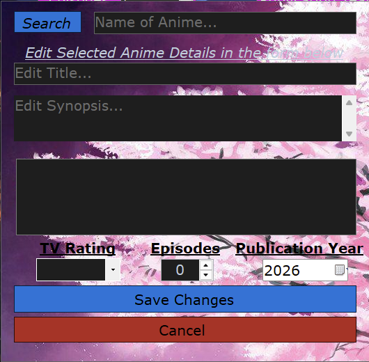
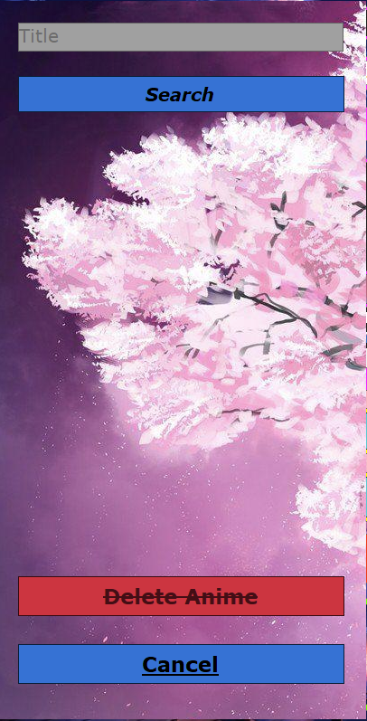

# TeamPiZAZ CPW211 Team Project: Anime Database Application


## Project Overview
This project is a collaborative software solution developed for the CPW211 coursework. Built as a desktop application using **Windows Forms** and **C#**, its primary goal is to provide a user-friendly interface to browse, manage, and catalog popular anime series. 

The application demonstrates robust database design and data management, interfacing seamlessly with a Microsoft SQL Server database using **Entity Framework Core**. It features a modern architecture utilizing Dependency Injection and a dedicated Service layer (`AnimeService`) to handle asynchronous CRUD operations.

### Meet the Team (TeamPiZAZ)
*   **Anthony Brunner**
*   **Zac Kimball**
*   **Zane Marcoe**

---

## Application Screenshots

 

 



 





---

## Key Features
*   **Comprehensive Data Display:** View detailed information about various anime, including Title, Synopsis, Release Year, Publication Year, TV Rating, Episode Count, Studio, and assigned Genres.
*   **Full CRUD Capabilities:** Add new anime, update existing entries, and delete records seamlessly.
*   **Complex Relationships:** Supports Many-to-Many relationships (e.g., assigning multiple Genres to a single Anime) and One-to-Many relationships (e.g., Studios to Anime).
*   **Advanced Data Handling:** Includes built-in support for filtering, paginating, and sorting data collections.
*   **Automated Database Migrations:** The application uses EF Core Code-First migrations and automatically applies pending migrations to build the SQL database upon startup.

---

## Technologies & Frameworks
*   **Language:** C# 14 (Targeting `.NET 10.0-windows`)
*   **UI Framework:** Windows Forms (WinForms)
*   **ORM:** Entity Framework Core (v10.0.10)
*   **Database:** Microsoft SQL Server (LocalDB/Express via connection string)
*   **Development Environment:** Highly optimized for Visual Studio 2026.

---

## Getting Started

Follow these steps to set up the project locally on your machine.

### Prerequisites
1.  [Download the .NET 10 SDK](https://dotnet.microsoft.com/download)
2.  Install **Visual Studio 2026** (Recommended for the best C# and WinForms experience)
3.  Ensure Microsoft SQL Server (or LocalDB) is installed and running.

### Installation & Execution
1.  **Clone the repository** to your local machine:
    ```bash
    git clone https://github.com/TeamPiZAZ/TeamPiZAZCPW211TeamProject.git
    ```
2.  **Open the Solution:**
    Navigate to the cloned directory and open `TeamPiZAZCPW211TeamProject.sln` in Visual Studio 2026.
3.  **Verify Database Configuration:**
    Open `appsettings.json` and ensure the `DefaultConnection` string matches your local SQL Server instance. The default is set to `localhost` with Windows Authentication:
    ```json
    "DefaultConnection": "Data Source=localhost;Database=AnimeCPW211Db;Integrated Security=True;Connect Timeout=30;Encrypt=True;Trust Server Certificate=True;"
    ```
4.  **Run the Application:**
    Hit `F5` or click the **Start** button in Visual Studio.
    *Note: The application is configured to automatically run Entity Framework Migrations on startup, so the `AnimeCPW211Db` database will be created and seeded automatically.*

---

##  Possible Upcoming Features
*   **User Contributions:** Allow end-users to add and contribute their own anime entries to the global list.
*   **Personalized Lists:** Implement a "Favorites" feature for users to save and track their watched anime.
*   **Community Rating System:** Introduce a feature for users to rate and review anime on a 1-10 scale.
*   **User Registration and Account Creation and management:** Allow users to create accounts, log in, and manage their profiles.

---
*Built with dedication by TeamPiZAZ.*
